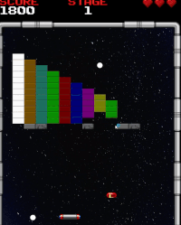
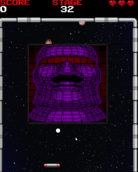

# Arkanoid FX - [Nhóm 10]
### Báo cáo Bài tập lớn OOP - [INT2204 10]

**Arkanoid FX** là một bản làm lại (clone) hiện đại của tựa game "brick-breaker" kinh điển, được xây dựng hoàn toàn bằng Java và JavaFX. Dự án này tập trung vào việc áp dụng các nguyên tắc Lập trình Hướng đối tượng (OOP) để tạo ra một cấu trúc game linh hoạt, dễ bảo trì và mở rộng.

Game không chỉ tái hiện lối chơi gốc mà còn bổ sung nhiều tính năng nâng cao như một chiến dịch (campaign) 32 màn chơi, trận đấu trùm (boss fight) kịch tính, hệ thống vật phẩm (power-up) đa dạng, và các hiệu ứng "game feel" hiện đại.

---
**Demo 1: Gameplay cơ bản & Power-up*

**Demo 2: Bắn Laser & Hiệu ứng**

**Demo 3: Trận đấu trùm (Boss Fight)**

---

## ✨ Tính năng nổi bật

Dự án game Arkanoid có các tính năng nâng cao như sau:

* **Chiến dịch 32 màn chơi:** Tải màn chơi linh hoạt từ các file `.txt` (trong `resources/stages`) thông qua `StageLoader`.
  
* **Đa dạng các loại gạch:**
    * **Gạch Màu (ColorBrick):** Gạch 1 HP, cho điểm số khác nhau.
    * **Gạch Bạc (SilverBrick):** Gạch nhiều HP, có hiệu ứng nứt vỡ trực quan (`BrickPainter`) khi nhận sát thương.
    * **Gạch Vàng (GoldBrick):** Gạch bất tử, không thể phá hủy.
      
* **Trận đấu Trùm (Boss Fight) kịch tính:**
    * Màn chơi cuối (Màn 32) là một trận đấu trùm thực sự với `BossBrick` (400x400, 64 HP).
    * **Boss chủ động tấn công:** Boss tự động bắn một "Cơn mưa Thiên thạch" (`Meteor Shower`) ngẫu nhiên từ đỉnh màn hình VÀ bắn một luồng thiên thạch từ chính nó.
    * **Boss thả vật phẩm:** Để cân bằng độ khó, Boss cũng tự động thả `Power-up` ngẫu nhiên sau một khoảng thời gian.
      
* **Hệ thống Vật phẩm (Power-Ups) đa dạng:**
    * `LASER (L)`: Cho phép Paddle bắn tia laser (bằng cách **Click Chuột**) để phá gạch.
    * `ADD_BALL (B)`: Thêm một quả bóng vào màn chơi. (File `PowerUpType` của bạn ghi là "làm chậm", nhưng logic code trong `GameManager` là `addBall()`).
    * `PADDLE_GROW (E)`: Tăng kích thước thanh đỡ.
    * `ADD_LIFE (P)`: Thêm 1 mạng (có logic thông minh không thả khi đầy máu).
      
* **Chướng ngại vật (Hazards):**
    * **Thiên thạch (Meteor):** Có tỉ lệ rơi ra khi phá gạch thường. Nếu va trúng Paddle, người chơi mất 1 HP.
      
* **Hệ thống UI/Menu hoàn chỉnh:**
    * `StartScreen`: Màn hình chính với nhạc nền.
    * `HowToPlayScreen`: Màn hình hướng dẫn chơi (mới thêm).
    * `PauseScreen`: Tạm dừng game.
    * `GameOverScreen`: Màn hình thua cuộc.
    * `StageClearScreen`: Hoạt ảnh chuyển màn.
    * `QuitScreen`: Màn hình xác nhận thoát.
      
* **Hệ thống Điểm cao (Scoreboard):**
    * Sử dụng `ScoreManager` để tự động **lưu và tải 5 điểm số cao nhất** vào file `resources/scores.txt`.
      
* **Hiệu ứng & "Game Feel" nâng cao:**
    * **Rung màn hình (Screen Shake):** Khi người chơi mất mạng, màn hình sẽ rung để tăng cảm giác va chạm.
    * **Hoạt ảnh Sprite:** Sử dụng `SpriteAnimator` để chạy hoạt ảnh cho `PowerUp` (lặp lại) và `Meteor` (chạy 1 lần rồi dừng).
    * **Âm thanh:** Quản lý âm thanh đầy đủ (SFX) cho mọi hành động (va chạm, bắn, chết, qua màn...).

---

## 🎮 Hướng dẫn chơi

* **Mục tiêu:** Phá vỡ tất cả gạch (trừ gạch Vàng) để qua màn. Đánh bại Trùm ở Màn 32.
* **Điều khiển:**
    * `A` / `D` hoặc `Mũi tên Trái/Phải`: Di chuyển thanh đỡ (Paddle).
    * `SPACE`: Phóng bóng khi bóng đang dính vào thanh đỡ (đầu màn/sau khi mất mạng).
    * `Click Chuột Trái`: Bắn Laser (khi đang có power-up Laser).
    * `ESC`: Tạm dừng game.

---

## 🏗 Cấu trúc dự án (Thiết kế OOP)

Dự án được thiết kế theo các nguyên tắc OOP (Đóng gói, Kế thừa, Đa hình):

### 1. Gói `org.example.arkanoid.core` (Bộ não)
* Chứa logic cốt lõi điều khiển trò chơi.
* `GameManager`: Lớp "Chúa" (God Class) quản lý toàn bộ vòng lặp game, trạng thái (state), và sự tương tác giữa các đối tượng.
* `GameLoop`: Sử dụng `AnimationTimer` của JavaFX để tạo vòng lặp game mượt mà.
* `PowerUpManager`: Chịu trách nhiệm tạo, cập nhật, và xử lý va chạm cho vật phẩm.

### 2. Gói `org.example.arkanoid.objects` (Các thực thể)
* Chứa tất cả các "diễn viên" trong game, kế thừa từ lớp `GameObject` trừu tượng.
* `MovableObject`: Lớp con của `GameObject`, bổ sung logic di chuyển (vận tốc).
* `Ball`, `Paddle`, `Laser`, `Meteor`: Các đối tượng di chuyển, kế thừa `MovableObject`.
* **Cây kế thừa `Brick`:**
    * `Brick` (abstract): Định nghĩa các hành vi chung (HP, điểm, `onCollisionEnter()`).
    * `ColorBrick`, `GoldBrick`, `SilverBrick`, `BossBrick`: Các lớp con cụ thể, thể hiện tính **đa hình** khi `GameManager` chỉ cần gọi `brick.update()` hoặc `brick.onCollisionEnter()` mà không cần biết đó là gạch gì.
* `StageLoader` & `BrickFactory`: Áp dụng mẫu thiết kế **Factory** để tách biệt logic "tải màn chơi" khỏi `GameManager`.

### 3. Gói `org.example.arkanoid.UIUX` (Giao diện & Tài nguyên)
* Chịu trách nhiệm về mọi thứ người chơi nhìn thấy và nghe thấy (Presentation Layer).
* `UIScreen` (abstract): Lớp cơ sở cho tất cả các màn hình menu.
* `StartScreen`, `PauseScreen`, `HowToPlayScreen`, v.v.: Các màn hình giao diện cụ thể.
* `ResourceManager` & `SoundEffectManager`: Áp dụng mẫu **Singleton** (thông qua các phương thức `static`) để tải và cung cấp tài nguyên (ảnh, font, âm thanh) cho toàn bộ game.
* `ScoreManager`: Quản lý logic đọc/ghi file điểm cao.

---

### Yêu cầu:
* Java JDK 17 (hoặc cao hơn).
* JavaFX SDK 17 (hoặc cao hơn).
* IDE (Khuyên dùng IntelliJ IDEA).

## 🛠 Công nghệ sử dụng

* **Ngôn ngữ:** Java (JDK 17)
* **Framework:** JavaFX (cho đồ họa, UI, xử lý input và âm thanh).
* **IDE:** IntelliJ IDEA.

---

## 👨‍💻 Thành viên nhóm
## Thành viên nhóm
| Ngọ Bùi Đức Anh | 24021368 | [@24021368-DucAnh](https://github.com/24021368-DucAnh) |
| Nguyễn Quốc Phong | 24021595 | [@Fmong123](https://github.com/Fmong123) |
| Trần Đức Anh | 24021376 | [@TrongTruongHop](https://github.com/TrongTruongHop) |
| Bùi Đình Cảnh | 24021392 | [@WilliamsBui-fnd](https://github.com/WilliamsBui-fnd) |

## 👨‍💻 Phân công Công việc Nhóm
| Tuần | Mục tiêu chính | Nguyễn Quốc Phong (Fmong123) | Ngọ Bùi Đức Anh (NgoBuiDucAnh) | Trần Đức Anh (TrongTruongHop) | Bùi Đình Cảnh (WilliamsBui-fnd) |
| :--- | :--- | :--- | :--- | :--- | :--- |
| **Tuần 5** | **Nền móng (Foundation)** | **(Lead) Xây dựng Khung sườn (Skeleton):**   • Cài đặt `GameLoop`, `GameManager`.   • Tích hợp `GameNavigator`. | **(Lead) Thiết kế Hệ thống:**   • Thiết kế UML.   • Cài đặt sơ bộ `Brick` và `StageLoader` (tải màn). | **Lập trình Paddle:**   • Cài đặt sơ bộ class `Paddle` (vị trí, kích thước, hình ảnh). | **Lập trình Ball:**   • Cài đặt sơ bộ class `Ball` (vị trí, kích thước). |
| | | | | | |
| **Tuần 6** | **Gameplay Cốt lõi (Core Loop)** | **(Lead) UI & Âm thanh:**   • `StartScreen`, `BackgroundManager`.   • `SoundEffectManager` (nhạc nền, SFX). | **Logic Gạch Nâng cao:**   • Hoàn thiện các loại Gạch (`Silver`, `Gold`).   • Cài đặt cơ chế *rơi* Power-up từ gạch. | **Logic Power-up (Phần 1):**   • Cài đặt va chạm `PowerUp` với `Paddle`.   • Sửa lỗi hitbox `Paddle`. | **(Lead) Logic Ball & Va chạm:**   • Cài đặt logic di chuyển (`velocity`).   • Xử lý va chạm (AABB) giữa `Ball` và `Paddle`/`Brick`. |collision...`   `Fix: paddle hitbox bug` | `Refactor: manageDirectionByVelocity`   `BallUpdate` |
| | | | | | |
| **Tuần 7** | **Hoàn thiện Tính năng (Features)** | **(Lead) Hoàn thiện UI:**   • `PauseScreen`, `GameOverScreen`.   • `GameUI` (HUD) hoàn chỉnh (điểm, mạng). | **Hệ thống Power-up (Phần 2):**   • Cập nhật logic HP gạch (`Brick HP update`).   • Thêm animation rơi cho `PowerUp`.   • Thêm ảnh Power-up vào `ResourceManager`. | **(Lead) Logic Power-up (Phần 2):**   • Cài đặt 3 Power-up chính: **`ADD_LIFE`**, **`ADD_BALL`**, **`PADDLE_GROW`**. | **Logic Game Nâng cao:**   • Cập nhật logic quản lý Điểm/Mạng (từ `GameManager`).   • Cập nhật logic `addHP` và Game Over. |
| | | | | | |
| **Tuần 8** | **Tính năng Nâng cao & Hoàn thiện (Polish)** | **(Lead) Hoàn thiện Hệ thống:**   • `Scoreboard` (lưu 5 điểm).   • `StageClearScreen`, `HowToPlayScreen`.   • Tích hợp & Merge code toàn nhóm. | **(Lead) Boss & Hiệu ứng:**   • Cài đặt **`Meteor`** (hazard).   • Cài đặt **`BossBrick`** (thả Meteor, thả Power-up).   • Cài đặt **`Screen Shake`**. | **Tính năng Nâng cao & Kiểm thử:**   • Cài đặt Power-up **`Laser`**.   • Viết **JUnit Tests** cho dự án. | **Logic Cốt lõi Nâng cao:**   • Nâng cấp logic va chạm Ball/Paddle (bóng dính `isSticky`). |
